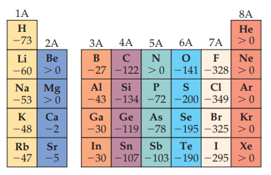

# SummerNotes
Aug 29 2021
***
## Atomic Theory
### Pre-modern
 - Democritus = concept of atom(indivisible), plato and aristotle say is impossible
 - Atom concept reemerged in europe 17th C bc chemists started thinking abt elements
 - Dalton = Theory linking elements and atoms
 - Thompson = Plum pudding(cathode rays working proves that there are negative particles in atoms
 - Rutherford(Gold foil, sees some alpha particles bounce back when hit nucleus(proves positive nucleus))
 - Bohr(circular energy level orbits, used spectra) 
### Modern/Quantum model
 - Heisenburg uncertian$ty principle
   - No good explaination in book as to why other than waves?
   - $\ \Delta x * \Delta (mv) \ge {h}\over{4\pi}$
   - $\Delta x$ is uncertianty, is far too big for electrons, negligible for everyday
 - Shrodinger's wave equations
   - Equations dealing with wve and particle e- behavior
   - Treated e- like plucked guitar string, observed nodes of waves
   - Square of wave function ($\psi^2$) gives us statistical meaning of location of e-
   - Solutions yield orbitals
 - Quantum numbers(describe orbitals)
   - Principle quantum number(n)
   : positive integer, n increase, energy level increase, avg dist from nuc inc
   - Angular momentum quantum number(l)
   : s/0, p/1, d/2, f/3, etc. l is on \[0,n-1], there are n possibilities for l
   - Magnetic quantum number ($m_l$)
   : $m_l$ is integer on(-l, l), show orientation of orbital
   - in atoms with many electrons, increasing l(spdf) values increase energy
     - Orbitals with same energy(same subshell) are called degenerate orbitals
   - Magnetic spin number ($m_s$)
   : is either $+{1\over 2}$ or $-{1\over 2}$
   - Pauli exclusion principle says no 2 e- can have same $n, l, m_l, m_s$ numbers
     - Implies each orbital can have a max of 2 e- and they must have opposite spins
   - Hunds rule says that an orbital's energy is minimized when there are the max number of same-spin e-
     - So for carbon the unfilled 2p orbital both are same $+{1\over 2}$ or $-$
     - These e- have parallel spin
## Periodic table
### Trends
 - Atomic Radius inc down and left
   - I guess bc the s orbitals are large and the other orbitals bring everything closer??
   - Technically is bacause $Z_{eff}$(Effective *nuclear* charge) increases across a period, pulls harder
 - Ionic Radii(Atomic radius but if was ionic)
   - Cations are smaller(e- removed from outer orbits, less internal e- repulsion overall)
   - Anions are larger(Same reason)
   - For ions carrying the same charge, ionic radius increases as we move down a column
   - Overall, ionic radius inc even more than atomic radius as go down
   - L/R pattern holds true
 - Ionization Energy(min energy required to remove an e- from ground state)(inc right and up)
   - First ionization energy($I_1$) is nrg req to strip element of one e-(second is 2 e- is $I_2$, etc)
   - Sharp increase in Ionization energy for inner-shell e-
   - Supports outer e- being used in chem. reactions
   - $I_1$ inc. across period(row), inc. up column(Group)
   - s and p blocks show larger range of $I_1$ than transition metals(f-block metals), f-block has small variation only
   - Roughly inverse correlated with atomic radius 
 - Electron Affinity(opposite Ionization energy)(inc to halogens)
   - Energy change when an e- is added
   - Trends complicated
   - 
   - Generally closest to completing an orbital is higher(halogens high, nobles low)
   - Don't change a lot as go down a group
 - Electronegativity: How much pulls e- in bond(inc right and up)
   - Disparity meaured in **bond polarity**(polar/nonpolar covalent)
   - *Linus Pauling* developed first and most used scale
   - Generally increase to right across period(most metalic to most nonmetalic)
   - Generall inc as go up period
# Misc 
## Sigfigs
 - Addition/Sub, preserve smallest # decimal places
 - Multiplication/Div, preserve smallest # sigfigs
## Molarity/Molality
 - Molarity = Moles/Volume(mL)
   - Moles is solvent
   - Volume is solution(solvent+solute)
 - Molality = Moles/Mass(g)
   - Moles is solvent
   - Mass is solute(not incl. solvent)
 - 