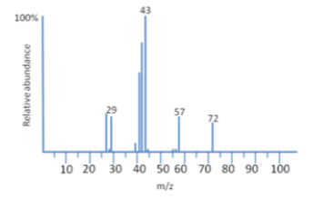
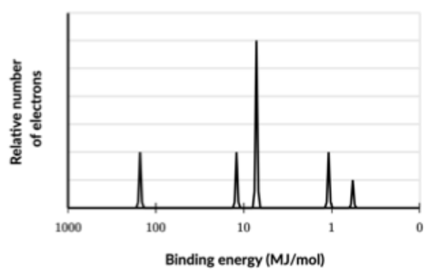
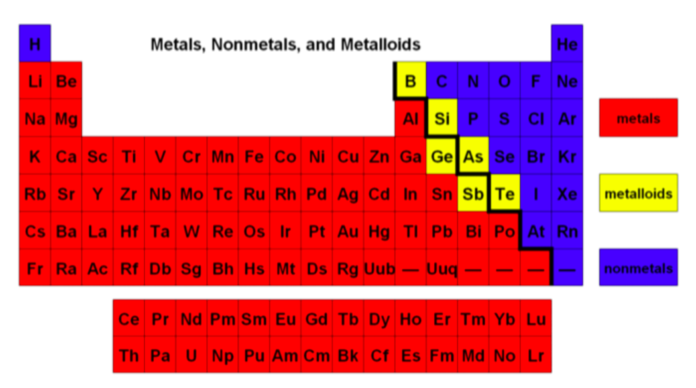
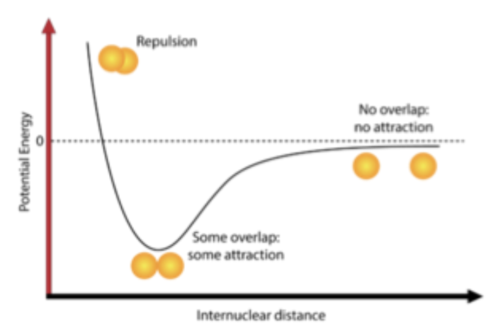
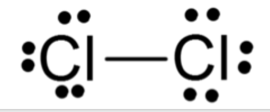
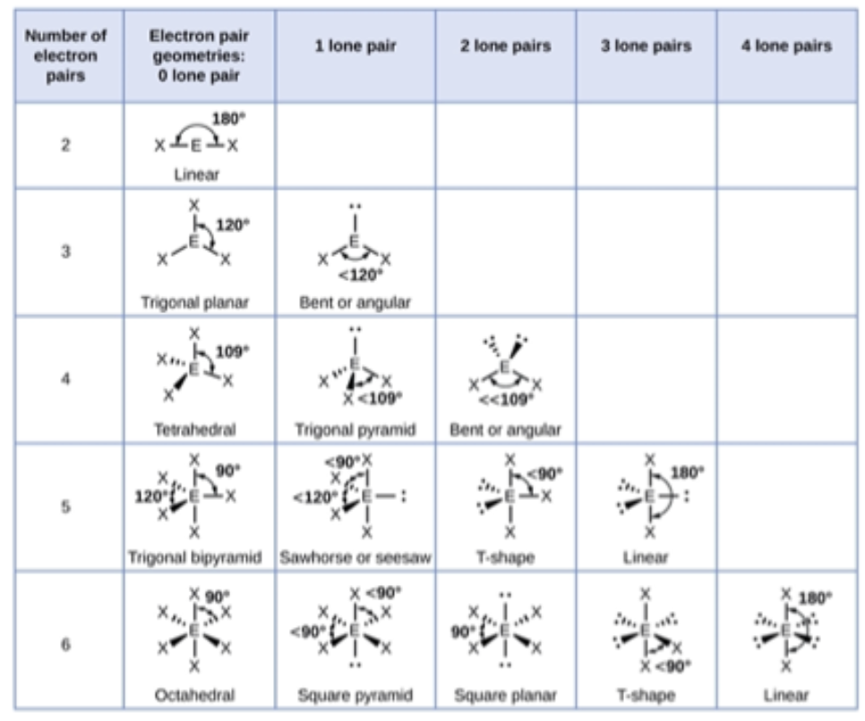

# midtermReview
Jan 12 2022
***
# Atomic Structure and Properties
## Concepts  
1. Moles and Molar Mass
 - 6.02x10^-23 atoms/mole
 - 
2. Mass Spec of Elements
 - Determines isotopes
 - Relative abundances weighted averages
 - 
 - Highest(most common isotope) peak = base peak 
 - z=-1 vaporized ions passed thru magnet, move more = lighter 

3. Classification of matter
 - Mixture/Pure Substance(can it be separated)
   - Mixture: Homogeneous(solution) if uniform composition, heterogeneous if not
     - Purity: $\frac{mass\ wanted\ substance}{mass\ total\ sample}$
   - Pure Sub: Compound if can be decomposed, Element if can't be
 - Hydrates(compounds)$Na_2CO_3\cdot H_2O$ - Water in ionic lattice 
 - Chemical Formula gives ratio of atoms present in a substance(of moles & mass), Empirical is lowest ratio 
 - **Law of definite proportions** - (Mass and Mole ratio constant)
4. Atomic Structure and Electron Configuration 
 - **Coulomb's law** - $F=k\frac{q_1q_2}{r^2}$
 - More non-valence e- = more shielding of nuclear charge on valence e-
 - Pauli Exclusion(spin/addresses), Aufbau(lowest orbitals first), Hund(spread out before 2 in any orbital) 
5. Photoelectron Spectroscopy 
 - Gaseous sample hit w/ UV/X-ray, nrg it takes to remove e- shows nrg lvl 
 - 
 - Each peak is subshell, height is relative #e-, nrg inc w/ aufbau shortcut
6. Periodic Trends 
  - Use Shielding and Radius to justify all changes(and shielding to justify radius)
    - Radius justify by nrg lvl/shell(1-7), shielding 
    - Electron-electron repulsion also pushes out, but countered strongly within row by inc proton pull
 - Ionization Nrg - Closer = Greater = Harder to pull e- away 
 - Electronegativity - atom attracting e- to itself 
 - Electron affinity - nrg for addition of atom(how much it wants an electron)(opp ionization nrg)
 - Metals/Metalloids/Nonmetals 
7. Valence e- and Ionic Compounds 
 - Balance to be neutral 
 - Cation decreases radius(possible lose shell, dec e-&e- repulsion)
 - Elements in the same groups tend to form similar compounds bc same ion charges 
## Problems 

# Molecular and Ionic Compound Structure and Properties 
1. Types of Chemical Bonds 
 - Ionic
   - Valence e- transferred(Metals+Nonmetals)(LARGE EN diff)
   - Lattice, hard to melt 
   - Soluble, conductive in water 
 - Covalent(shared e-, btw nonmetals, not conductive)
   - Polar 
     - e- shared unequally(higher EN in unequal places)
     - Diff ~.04-1.8
     - Soluble
   - NonPolar(all opp polar, < en diff)
   - Network 
     - Btw Identical atoms or very close EN 
     - Large lattices - High melting points, not soluble, very hard 
     - SiO4
 - Metallic
   - **Delocalized** Valence e-
   - Between metals only 
   - High melting, not soluble, conductive, malleable, ductile
   - Stronger if atoms can give more e- 
2. Intramolecular Force and Potential Energy 
 - Bond Strength - Coulombs law, larger q1q2 = larger electrostatic force, smaller dist(r) = larger electrostaticforce
 - Morse Potental diagrams(Potential nrg/bond strength vs Internuclear distance), balance
 - 
3. Structure of Ionic Solids(lattices)
 - ions change size when entering 
 - Brittle bc snap out of place when +/+&-/- next to eachother
4. Structure of Metals and Alloys
 - Delocalized e- allow for properties(e- always fills spot next to p+)
 - Substitutional(intro new element of similar size)
 - Interstitial(intro smaller element)
 - Combination(both)
 - In general, harder atomic motion = less malleable, less ductile, etc 
5. Lewis Diagrams 
 - ionic - $2[Al]^{3+}3[O]^{2-}$(brackets and powers of things, neutral overall)
 - Covalent - shared rep w/ line, unboned as lone pair
 - 
   - Count Valence e- w/ charge
   - ID central atom(lowest EN, begins formula, wants to form most # bonds), atch as many single bonds as possible
   - Complete octets w/ lone pairs
   - Add remaining valence to central atom 
   - Complete octet of central by coverting lone pairs to bonds(double counted as valence e-)
 - Exceptions to Octet: 1st Shell(2e-), Incomplete octets low EN(Be, B, Al(transition)), d orbital hybridization expand octet
 - Bond strength(#shared e- inc q in coulombs law, dec r)
6. Resonance and Formal Charge 
 - Resonance - Avg structures if mult correct, bond order = #bonds/#bonding locations(or logic)
 - Formal Charge = # Valence e- - # covalent bonds - #e- in lone pairs(counts all e- but single counts bonds)(octet rule double counts bonds so they balance out)
 - Most accurate lewis structure - Min formal charges, neg charges on mose EN atom,
7. VSEPR and Bond Hybridization 
 - VSEPR 
   - Electron dense areas(steric #) - Lone or bonded pairs of any order 
   - Shapes based on wanting to separate e-
   - 
   - Polarity/Symmetry
 - Hybridization 
   - Mixing of atomix orbitals to max stability 
   - Requires nrg to excite e- from lower lvl  
   - Can get better/more stable orbitals w/ hybridization w/ more evenly distributed e-  
   - Same VSEPR Shapes just w/ number *orbitals* being combined ex: sp = linear 
   - Bonding = e- overlap, first in nuclear plane w/ sigma bonds btw hybridized sp orbitals, then w. p orbitals, take up space around molec bc off nuclear plane   
   - Always one sigma bond, following ones are pi
# Intramolecular Forces and Properties
1. Intermolecular Forces 
 - Columbs law btw 2+ molecs 
 - ion-dipole, dip-dip, Hbond, ion-induced dipole, dipole-induced dipole, LDFs
 - Stronger partial cherges = stronger IMFs
 - H-bonding needs very EN(O,F,N)
 - LDFs - **Polarizability** #e-, size, shape, *Bond types(pi bonding inc area e- are spread over)*
2. Properties of Solids 
 - Diff w/ ionic metallic, covalend, network covalent 
3. Solids, Liquids, and Gases
 - Phase changes + names, cooling = nrg released 
 - Constancy of volume and shape
4. Ideal Gas Law 
 - Assumptions of ideal gases - 1.small/hard/insig volume 2.fast, random, straight lines w/ constant speed 3.elastic collisions 4.no IMFs 5.nrg solely based on temp 
 - Pressure - P=Force(particle bounce)/Area(walls of container)
 - $PV = nRT$
 - Partial pressures law - total pressure = sum of each gasses's pressures 
 - Diffision/effusion(Graham's law, effusion rate $\propto \frac{1}{\sqrt{M}})$, applicaiotn of KM theory 
 - 
5. Kinetic Molecular Theory 
 - $KE = 1/2mv^2$, assumed to have insig potential nrg  
 - $KE\propto Kelvin temp$ 
 - Maxwell boltzmann curves of kinetic nrg averages w/ inc porportion beyond avg temp 
6. Deviation from Ideal Gas Law 
 - Break simplifications of ideal gasses - more IMFs
 - Most ideal at High temp, low pressure, high volume 
7. Solutions and Mixtures 
 - Solns - homogeneous mixtures of solute and solvent of any state of matter 
 - Molarity - Moles/L soln 
 - Dilutions $M_1V_1 = M_2V_2$
 - Steps to solvation - Dissolving(chunks), Dissociation(molec sep(ions)), Solvation(Stabilized by solvent interactions)
 - "Like disolves like"(dont say this say specific type)
 - Saturated - solvent dissolved max amnt of solute
 - Filtration - for solids and liquids, dosent work with solutions 
 - Distillation - burner, evap, etc, sep by boiling point
8. Representations of Solutions 
 - Rep w/ charges and such
9.  Separation of Solutions and Mixtures Chromatography 
 - Chromatography sep by polarity
   - Mobile phase, stationary phase
   - Paper+TLC, move up stationary phase(tlc fancier stationary)
   - Column chromatography(fancy, move down tube)
10. Solubility 
 - Unlimited solubility = miscibile, with very similar IMFs and polarity 
 - Unsaturated/Saturated/Supersaturated
 - Solubility rules(Na+, Li+, K, NO3, NH3) all soluble
11. Spectroscopy and the em Spectrum 
 - Microwaves - Rotate atoms in molec; Infared - Transition e- vibration lvls; UV/Vis - molec nrg lvls; X-rays&>> = Ionization
 - Infared vibration = periodic change of dipole, stronger absorb if stronger polarity 
12. Photoelectric Effect 
 - 1. Absorption - e- absorbs nrg, 2. Excitation - e- is excited, 3. Emission - e- returns, light released as nrg 
 - conserv. nrg, nrg of photon(quantized) as  $c=\lambda v$, $E=hv$
13. Beer-Lambert Law
 - Use light absorb to det. concentration of diff colored solns 
 - Use standard curve(w/ known concentrations), constant path length(cuvette measurement), substance 
 - $A = \epsilon bc$ - Absorbance, Molar absorptivity, path length, concentration 
 - 

# Chemical Reactions 
1. Introduction for reactions 
2. Net Ionic Equations 
3. Representations of Reactions 
4. Physical and Chemical Changes 
 - 
5. Stoichiometry
6. Introduction to Titration 
7. Types of Chemical Reactions 
8. Introduction to Acid-Base Reactions 
9.  Oxidation-Reduction (Redox) Reactions 

# Kinetics 
1. Reaction Rates 
2. Introduction to Rate Law 
3. Concentration Changes Over Time
4. Elementary Reactions 
5. Collision Model
6. Reaction Energy Profile 
7. Introduction to Reaction Mechanisms 
8. Reaction Mechanism and Rate Law 
9. Stead-State Approximation 
10. Multistep Reaction Energy Profile 
11. Catalysis 
